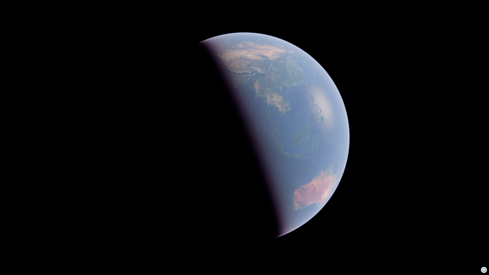

# Where the Sun Goes

[English](#english) | [日本語](#japanese)

🔗 **Live**: https://eukarya-biz.github.io/navara-hw-misaki/

---

## English

A sunset-viewing map built with [Navara](https://navara-docs.netlify.app/) (`@navara/three`). Click anywhere in the world to preview what sunset looks like there, at ground level, at the moment the sun sits at the horizon.

### Features

- **Click anywhere on the globe** to fly the camera to that spot, at a height sampled from the real terrain.
- **Auto-computed sunset time**: for the currently selected day and location, the app finds the moment the sun's elevation crosses the horizon and aims the camera at the sun.
- **Japan's Sunset 100 (夕陽百選)**: 106 curated scenic sunset spots across Japan are shown as map markers and in a searchable list, sourced from [100sen.cyber-ninja.jp](https://100sen.cyber-ninja.jp/).
- **Adjustable controls**: calendar date picker, a height slider (how far above the ground the camera sits), and a time slider (nudge ± 2 hours around the computed sunset moment, shown as a relative offset like "-45m" or "+1h30m" rather than a clock time, since the sunset moment itself is only a longitude-based estimate and an absolute time would imply more precision than that estimate can back up).
- **Compass**: shows the camera's live heading.
- **Initial overview**: opens on a bright, top-down view of the whole Japanese archipelago before zooming into any specific sunset.

### Implementation notes

- **Sun position is computed independently of `view.atmosphere.sunDirection`.** That value only reflects the last *rendered* frame, so writing `date` repeatedly (e.g. while searching for sunset time) reads back stale directions. This app derives elevation/azimuth directly from a standard low-precision solar position formula instead.
- **Camera height is terrain-aware.** Clicking a spot samples the real ground height there, rather than assuming a flat plane.
- **Sunset-100 markers are pulled live from Re:Earth CMS** and rendered as a GeoJSON source/layer.

### Setup

1. `pnpm i`
2. `pnpm dev`
3. Access `http://localhost:8080/`

---

## 日本語

[Navara](https://navara-docs.netlify.app/)（`@navara/three`）で作った、夕陽鑑賞マップです。世界のどこでもクリックすると、その場所の地上から見た、太陽がちょうど地平線にある瞬間の景色をプレビューできます。

### 特徴

- **地球上のどこでもクリック**すると、実際の地形から取得した高さでカメラがその地点まで飛びます
- **日没時刻の自動計算**: 選択中の日付・場所について、太陽の高度が地平線を横切る瞬間を探し、太陽の方向へカメラを向けます
- **夕陽百選**: [100sen.cyber-ninja.jp](https://100sen.cyber-ninja.jp/) を出典とする、日本全国106箇所の夕陽の名所を地図上のマーカーと検索可能なリストで表示します
- **調整可能なコントロール**: カレンダーの日付ピッカー、高さスライダー（カメラが地表からどれだけ高い位置にあるか）、時間スライダー（計算された日没の瞬間を中心に前後2時間ずらせます。表示は「-45m」「+1h30m」のような相対オフセットで、絶対時刻では表示しません。日没の瞬間自体が経度ベースの推定値にすぎず、絶対時刻で表示すると実際にはない精度があるかのように見えてしまうためです）
- **コンパス**: カメラの向きをリアルタイムに表示します
- **初期表示**: 特定の夕陽にズームする前に、日本列島全体を明るい俯瞰視点で表示します

### 実装のポイント

- **太陽の位置は`view.atmosphere.sunDirection`を使わず独自計算しています。** この値は最後に実際に描画されたフレームの値しか反映されず、`date`を繰り返し書き換えても（日没時刻を探索する処理など）古い値を読み返してしまうためです。代わりに、標準的な低精度の太陽位置計算式から仰角・方位角を直接算出しています
- **カメラの高さは地形を考慮しています。** 地点をクリックすると、平面を仮定せず実際の地表の高さをその場でサンプリングします
- **夕陽百選のマーカーはRe:Earth CMSからリアルタイムに取得**し、GeoJSONのsource/layerとして描画しています

### セットアップ

1. `pnpm i`
2. `pnpm dev`
3. `http://localhost:8080/` にアクセス

---

## License

Licensed under either of

- Apache License, Version 2.0
  ([LICENSE-APACHE](LICENSE-APACHE) or http://www.apache.org/licenses/LICENSE-2.0)
- MIT license
  ([LICENSE-MIT](LICENSE-MIT) or http://opensource.org/licenses/MIT)

at your option.
